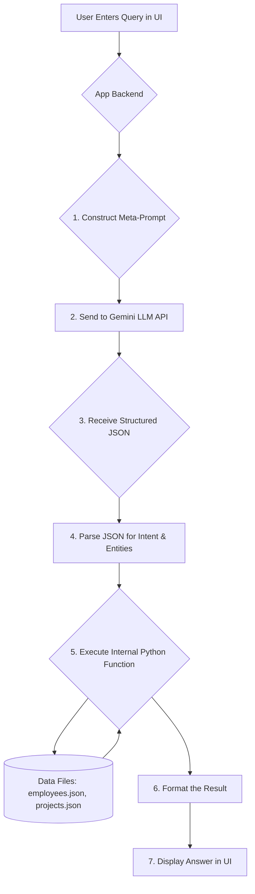

# Employee and Project Management System with NLP Search

This Streamlit application provides a comprehensive system for managing employee data and project allocations. Its standout feature is an advanced search bar powered by Google's Gemini LLM, allowing administrators to ask complex, natural language questions about their workforce and project landscape.

## Overview

The system has two main functionalities:
1.  **Data Management:** A UI for creating and viewing employee records and allocating them to projects. All data is stored in local JSON files (`employees_data.json`, `project_allocations.json`).
2.  **NLP Search:** A powerful, conversational search interface that allows admins to find information without needing to manually filter data. This is achieved through a hybrid approach that leverages the Gemini LLM for language understanding and internal Python code for reliable data retrieval.

---

## The Gemini Hybrid Approach

To provide a flexible and powerful search experience, this application uses a hybrid model that combines the strengths of a Large Language Model (LLM) with the reliability of deterministic code.

*   **LLM for Understanding:** We use the Gemini LLM to parse the user's unstructured, natural language query. Its only job is to understand the user's *intent* and extract the key *entities* (like names, skills, or percentages). It then returns this information as a structured JSON object.
*   **Python for Execution:** The application backend receives this JSON object. Based on the intent, it calls the appropriate internal Python functions to securely fetch, calculate, and filter data from the local JSON files.

This approach is both powerful and safe. The LLM provides the flexibility to understand almost any phrasing the user might try, while the Python code ensures that the data retrieval is accurate, predictable, and secure.

---

## Prerequisites and Setup

To run the NLP search feature, you will need the following:

1.  **Python Environment:** A working Python 3.8+ environment.
2.  **Required Libraries:** Install the necessary libraries.
    ```bash
    pip install streamlit pandas google-generativeai
    ```
3.  **Gemini API Key:**
    *   Obtain an API key from [Google AI Studio](https://aistudio.google.com/app/apikey).
    *   Store this key securely. The recommended way in Streamlit is to use the built-in secrets management. Create a file named `.streamlit/secrets.toml` in the project directory and add your key to it:
      ```toml
      # .streamlit/secrets.toml
      GEMINI_API_KEY = "YOUR_API_KEY_HERE"
      ```

---

## How the NLP Search Works: A Step-by-Step Flow

The entire process from user question to system answer is completed in a fraction of a second. Here is a breakdown of the internal flow.

### Flow Diagram



### Detailed Steps

1.  **User Input:** An admin types a question into the search bar.
    > **Example:** "show me aiml engineers with pytorch and tensorflow for 50%"

2.  **Meta-Prompt Construction:** The backend code takes the user's query and wraps it inside a larger "meta-prompt" that instructs the LLM on its task.
    > **Simplified Meta-Prompt:**
    > `You are a query parser. Convert the following user prompt into a JSON object with an "intent" and "entities". [...] User's Prompt: "show me aiml engineers with pytorch and tensorflow for 50%"`

3.  **Gemini LLM API Call:** The complete meta-prompt is sent to the Gemini API.

4.  **Structured JSON Response:** The LLM processes the prompt and, instead of answering directly, returns a clean JSON object as instructed.
    ```json
    {
      "intent": "search_candidate",
      "entities": {
        "designation": "AI/ML/Data Scientist",
        "skills": ["PyTorch", "TensorFlow"],
        "allocation_needed": 50
      }
    }
    ```

5.  **Python Execution Engine:** The backend receives this JSON. A simple `if/elif` statement checks the `intent`.
    *   Since the intent is `search_candidate`, the application knows it needs to run the employee search and ranking logic.

6.  **Data Retrieval & Logic:** The corresponding Python function is executed. It loads data from `employees_data.json` and `project_allocations.json`, filters by designation, checks available allocation, and calculates a skill-match score for the remaining candidates.

7.  **Display Results:** The final, sorted list of candidates is formatted into a user-friendly view and displayed on the screen.

---

## Examples of Supported Questions

This system can handle a wide variety of conversational questions, including:

*   **Finding Candidates:**
    *   "I need a Backend Developer with Python and Django skills available for 40% allocation."
    *   "Show me all frontend developers."
    *   "Find me a DevOps engineer with AWS and Kubernetes experience."

*   **Checking Project Allocations:**
    *   "In which project is Neeraj Pokala working?"
    *   "Show me the projects for Abhinandan."

*   **Checking Employee Allocation:**
    *   "What is the total allocation for Mehtab?"
    *   "How much is Priya Sharma allocated?"

## Extensibility

This architecture is highly extensible. To add a new capability (e.g., "how many employees are in the Hyderabad location?"), we would simply:
1.  Add a new intent called `count_employees_by_location` to the meta-prompt's instructions.
2.  Add an `elif intent == "count_employees_by_location":` block to the Python execution engine with the logic to perform the count.
