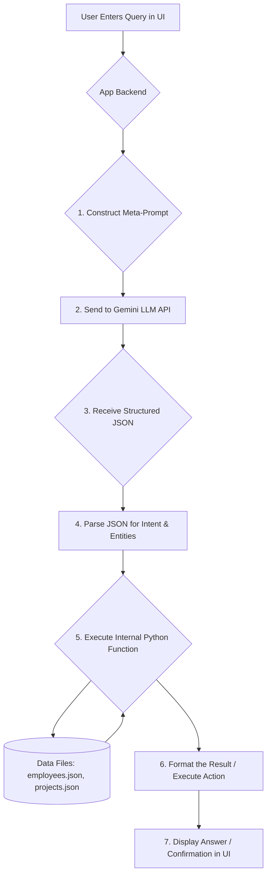

# Employee and Project Management System with NLP Search

This Streamlit application provides a comprehensive system for managing employee data and project allocations. Its standout feature is an advanced search bar powered by Google's Gemini LLM, allowing administrators to ask complex, natural language questions about their workforce and project landscape.

## Overview

The system has two main functionalities:
1.  **Data Management:** A UI for creating and viewing employee records and allocating them to projects. All data is stored in local JSON files (`employees_data.json`, `project_allocations.json`).
2.  **NLP Capabilities:** A powerful, conversational interface that allows admins to interact with the system using natural language. This is achieved through a hybrid approach that leverages the Gemini LLM for language understanding and internal Python code for reliable data retrieval and action execution.

---

## The Gemini Hybrid Approach

To provide a flexible and powerful experience, this application uses a hybrid model that combines the strengths of a Large Language Model (LLM) with the reliability of deterministic code.

*   **LLM for Understanding:** We use the Gemini LLM to parse the user's unstructured, natural language query. Its only job is to understand the user's *intent* and extract the key *entities* (like names, skills, or percentages). It then returns this information as a structured JSON object.
*   **Python for Execution:** The application backend receives this JSON object. Based on the intent, it calls the appropriate internal Python functions to securely fetch, calculate, filter data, or execute actions (like saving allocations) from the local JSON files.

This approach is both powerful and safe. The LLM provides the flexibility to understand almost any phrasing the user might try, while the Python code ensures that the data retrieval and action execution are accurate, predictable, and secure.

---

## Prerequisites and Setup

To run the application, you will need the following:

1.  **Python Environment:** A working Python 3.8+ environment.
2.  **Required Libraries:** All necessary libraries are listed in `requirements.txt`. Install them using pip:
    ```bash
    pip install -r requirements.txt
    ```
3.  **Gemini API Key:**
    *   Obtain an API key from [Google AI Studio](https://aistudio.google.com/app/apikey).
    *   Store this key securely. The recommended way in Streamlit is to use the built-in secrets management. Create a file named `.streamlit/secrets.toml` in the project directory and add your key to it:
      ```toml
      # .streamlit/secrets.toml
      GEMINI_API_KEY = "YOUR_API_KEY_HERE"
      ```

---

## Key Features & Enhancements

### 1. Natural Language Project Allocation (Admin Page)

Admins can now allocate projects to employees using natural language commands directly within the main Admin Dashboard. The system parses the request, validates all parameters (employee, project, dates, allocation percentage, and the 100% allocation rule), and then saves the allocation.

*   **Example Prompt:** "allocate Mehtab to Wellora project from 2025-09-17 to 2025-09-20 with 50% allocation"

### 2. Expanded Advanced Search Capabilities

The dedicated "Advanced Search" page now supports a much wider range of conversational queries.

*   **New Intents:** The system can now answer questions about an employee's:
    *   **Email**
    *   **Date of Joining (DOJ)**
    *   **Years of Experience**
    *   **Location**
*   **Improved User Experience:**
    *   A **loading spinner** (`st.spinner`) is displayed while the query is being processed.
    *   An **"Show LLM Interpretation" expander** provides transparency by showing the recognized intent and the raw JSON response from the LLM.

### 3. Comprehensive Dependency Management

A `requirements.txt` file has been created, making it easy to set up the development environment and ensure all necessary Python packages are installed.

### 4. Testing Examples

A `QUESTIONS.md` file is available in the project directory, providing a list of example questions for each supported intent to help with testing and demonstration.

---

## How the NLP Works: A Step-by-Step Flow

The core process for handling natural language queries remains consistent across all NLP-powered features.

### Flow Diagram



### Detailed Steps

1.  **User Input:** An admin types a question or command into the designated natural language input field.

2.  **Meta-Prompt Construction:** The backend code takes the user's input and wraps it inside a larger "meta-prompt" that precisely instructs the LLM on its task of parsing the query into a structured JSON object.

3.  **Gemini LLM API Call:** The complete meta-prompt is sent to the Gemini API.

4.  **Structured JSON Response:** The LLM processes the prompt and returns a clean JSON object containing the identified `intent` and extracted `entities`.

5.  **Python Execution Engine:** The backend receives this JSON. A robust `if/elif` structure checks the `intent` and executes the corresponding Python logic.

6.  **Data Retrieval & Logic / Action Execution:** The relevant Python function(s) are executed. This might involve:
    *   Loading data from `employees_data.json` and `project_allocations.json`.
    *   Performing calculations, filtering, or lookups.
    *   Executing actions like saving new project allocations after thorough validation.

7.  **Display Results / Confirmation:** The final result (e.g., an answer to a question, a success message for an allocation, or an error message) is formatted and displayed to the user.

---

## Examples of Supported Questions

This system can handle a wide variety of conversational questions and commands:

### 1. Candidate Search (`search_candidate`)
*   "I need a Backend Developer with Python and Django skills available for 40% allocation."
*   "Show me AI/ML Data Scientists with TensorFlow and PyTorch."
*   "Find me a DevOps engineer with AWS and Kubernetes available for 75%."

### 2. Employee Project Information (`find_employee_projects`)
*   "What projects is Abhinandan working on?"
*   "In which projects is Neeraj Pokala involved?"

### 3. Employee Allocation Details (`get_employee_allocation`)
*   "What is the total allocation for Mehtab?"
*   "How much is Priya Sharma allocated?"

### 4. Employee Skill Information (`get_employee_skills`)
*   "What skills does Pokala Neeraj have?"
*   "Show me Abhinandan's skills."

### 5. Employee Contact Information (`get_employee_phone`, `get_employee_email`)
*   "What is Abhinandan's phone number?"
*   "Email for Neeraj Pokala."

### 6. Employee Role & Department (`get_employee_department`, `get_employee_designation`)
*   "Which department does Abhinandan work in?"
*   "What is Neeraj Pokala's designation?"

### 7. Employee Identification (`get_employee_id`)
*   "What is the employee ID of Mehtab?"

### 8. Employee Experience (`get_employee_experience`)
*   "How much experience does Pokala Neeraj have?"

### 9. Project Allocation Command (`allocate_project`)
*   "Allocate Mehtab to Wellora project from 2025-09-17 to 2025-09-20 with 50% allocation."
*   "Assign Abhinandan to Project Alpha, start 2025-10-01 end 2026-03-31, 75%."