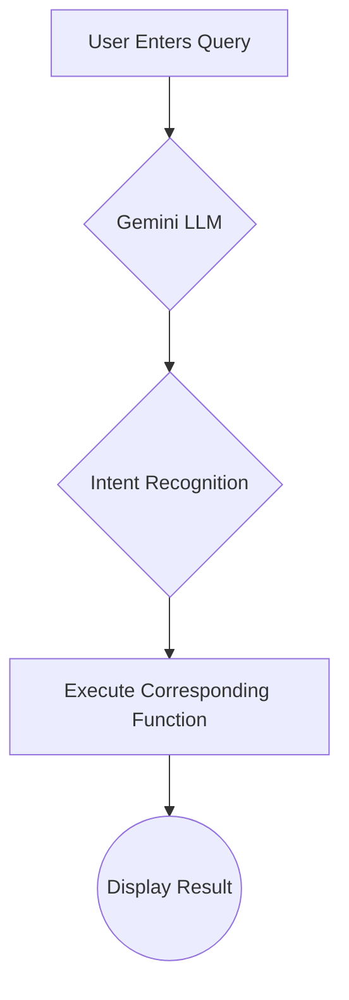
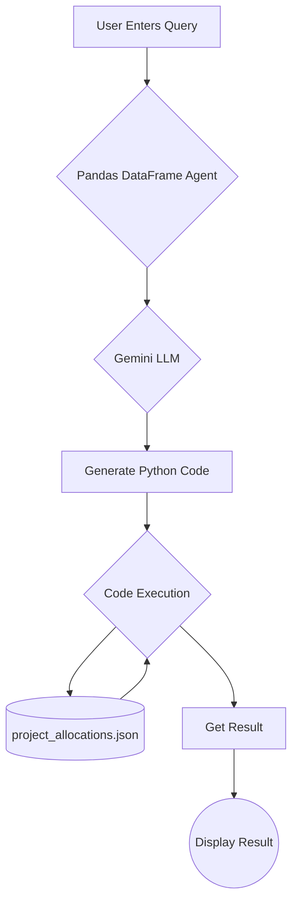

# Employee and Project Management System with NLP Search

This Streamlit application provides a comprehensive system for managing employee data and project allocations. Its standout feature is an advanced search bar powered by Google's Gemini LLM, allowing administrators to ask complex, natural language questions about their workforce and project landscape.

## Features

*   **Login System:** Role-based access for "Admin" and "Employee".
*   **Employee Management:**
    *   Create new employee records with detailed information.
    *   Input validation for Employee ID, email, and phone number.
    *   Dynamic skill selection based on job designation.
*   **Project Management:**
    *   Allocate projects to employees individually.
    *   Bulk project allocation via CSV upload.
    *   View all project allocations in a clean, tabular format.
    *   Prevents over-allocation of employees (ensures total allocation is <= 100%).
*   **NLP-Powered Features (Admin-only):**
    *   **Natural Language Project Allocation:** Allocate projects using simple sentences.
    *   **Intent-Based Search:** Ask complex questions about employees, their projects, skills, and availability.
    *   **Agentic Search:** A powerful, conversational interface that allows admins to interact with the system using natural language to query the project allocations data.
*   **Dashboard & Analytics (Admin-only):**
    *   View all employee data.
    *   Download employee data as a JSON file.
    *   Sidebar with key metrics: Total Employees, Number of Departments, and Number of Designations.

---

## Prerequisites and Setup

To run the application, you will need the following:

1.  **Python Environment:** A working Python 3.8+ environment.
2.  **Required Libraries:** All necessary libraries are listed in `requirements.txt`. Install them using pip:
    ```bash
    pip install -r requirements.txt
    ```
3.  **Gemini API Key:**
    *   Obtain an API key from [Google AI Studio](https://aistudio.google.com/app/apikey).
    *   Store this key securely. The recommended way in Streamlit is to use the built-in secrets management. Create a file named `.streamlit/secrets.toml` in the project directory and add your key to it:
      ```toml
      # .streamlit/secrets.toml
      GEMINI_API_KEY = "YOUR_API_KEY_HERE"
      ```

---

## How to Run

1.  **Install Dependencies:**
    ```bash
    pip install -r requirements.txt
    ```
2.  **Run the Streamlit App:**
    ```bash
    streamlit run app.py
    ```

---

## Detailed Features

### 1. Login System

The application features a simple login system with two predefined roles:

*   **Admin:** Has full access to all features, including employee and project management, and the advanced NLP search.
    *   **Username:** `admin`
    *   **Password:** `admin`
*   **Employee:** Has limited access, and can only view and add employee data.
    *   **Username:** `employee`
    *   **Password:** `employee`

### 2. Employee Management

*   **Create Employee:** A user-friendly form to add new employees.
*   **Data Validation:**
    *   **Employee ID:** Must be in the format `TM` followed by 5 digits (e.g., `TM12345`).
    *   **Email:** Must be a valid `@gmail.com` address.
    *   **Phone Number:** Must be exactly 10 digits.
*   **Dynamic Skills:** The list of available skills dynamically updates based on the selected **Designation**, ensuring relevance.

### 3. Project Management (Admin-only)

*   **Individual Project Allocation:** Admins can assign an employee to a project, specifying the start date, end date, and their allocation percentage. The system prevents allocating an employee beyond 100%.
*   **Bulk Project Allocation:** For efficiency, admins can upload a CSV file to allocate multiple projects at once. A downloadable template is provided to ensure the correct format.
*   **View Allocations:** A dedicated section to view all current project allocations.

### 4. NLP Capabilities (Admin-only)

This application uses a hybrid model that combines the strengths of the Gemini LLM for understanding natural language with the reliability of Python for execution.

#### a. Natural Language Project Allocation

Admins can allocate projects using simple, conversational commands.

*   **Example:** `"allocate Mehtab to Wellora project from 2025-09-17 to 2025-09-20 with 50% allocation"`

#### b. Intent-Based Search

The "Intent-Based Search" page allows admins to ask a wide range of questions about their employees.

*   **Candidate Search:**
    *   `"I need a Backend Developer with Python and Django skills available for 40% allocation."`
    *   `"Find me a DevOps engineer with AWS and Kubernetes available for 75%."`
*   **Employee Information:**
    *   `"What projects is Abhinandan working on?"`
    *   `"What is the total allocation for Mehtab?"`
    *   `"What skills does Pokala Neeraj have?"`
    *   `"What is Abhinandan's phone number?"`
    *   `"Which department does Abhinandan work in?"`
    *   `"How much experience does Pokala Neeraj have?"`

#### c. Agentic Search

The "Agentic Search" page provides a powerful, conversational interface that allows admins to interact with the system using natural language to query the `project_allocations.json` data. This feature uses a Pandas DataFrame Agent to translate natural language into Python code and execute it.

*   **Example:** `"what is the total allocation for the wellora?"`

**Warning:** This feature uses an agent that can execute arbitrary code. Use with caution.

---

## How the Intent-Based Recognition Works

The core process for handling natural language queries is as follows:



1.  **User Input:** An admin types a question or command.
2.  **Gemini LLM:** The query is sent to the Gemini LLM.
3.  **Intent Recognition:** The LLM determines the user's intent and extracts relevant entities.
4.  **Function Execution:** Based on the recognized intent, the corresponding Python function is executed to fetch data or perform an action.
5.  **Display Results:** The final result is displayed to the user.

---

## How the Agentic Search Works

The Agentic Search feature uses a different approach to answer questions.



1.  **User Input:** An admin types a question into the Agentic Search page.
2.  **Pandas DataFrame Agent:** The query is passed to a Pandas DataFrame Agent, which is specifically designed to work with data in a DataFrame.
3.  **Gemini LLM:** The agent uses the Gemini LLM to understand the user's query and translate it into Python code (using the Pandas library).
4.  **Code Execution:** The generated Python code is then executed against the `project_allocations.json` data.
5.  **Display Result:** The final result of the code execution is displayed to the user.